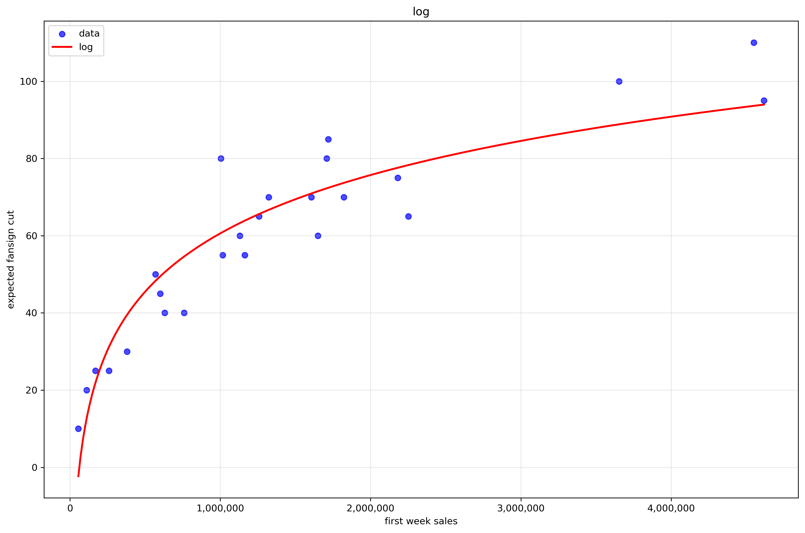

# 팬싸컷 예측기 / The First Fansign Cut Predictor for Kpop Idols / 签售门槛预测器

This project predicts the estimated number of albums required to purchase for a chance to enter a K-Pop fansign event, based on the first-week album sales. / 이 프로젝트는 초동 앨범 판매량을 기반으로 K팝 팬사인회에 들어갈 수 있는 예상 앨범 구매 수량을 예측합니다.

**Disclaimer:** The fansign cut can vary greatly depending on the entertainment company and the company that sells the albums. / **주의:** 팬싸컷은 기획사마다 다르며 여러 요인에 따라 크게 달라질 수 있습니다. 이 모델은 커뮤니티 데이터를 기반으로 한 추정치를 제공하므로 절대적인 기준으로 생각해서는 안 됩니다.

## How it Works / 작동 방식

The prediction is based on a linear regression model trained on first-week album sales data (Hanteo Chart) and estimated fansign cuts from various Korean online communities. / 이 예측은 한터차트 기준 초동 앨범 판매량과 여러 한국 온라인 커뮤니티에서 수집된 팬싸컷 추정치를 학습한 선형 회귀 모델을 기반으로 합니다. 데이터는 llm_craw_dataset.csv에서 확인 가능합니다.

### Model Details / 모델 정보

This tool provides three different regression models to estimate the fansign cut. The R_2 value indicates how well the model fits the data, with a value closer to 1.0 being a better fit. So in our analysis, we can see that log regression is the best representation of 팬싸컷(fansign-cut).

---

#### 1. Logarithmic Regression / 로그 회귀 (Best Model, or the most accurate model)
*   **Formula / 공식:** `y = 21.8017 * ln(x) + -240.6033`
*   **R-squared Score / 결정 계수:** `0.8655`

---

#### 2. Linear Regression / 선형 회귀
*   **Formula / 공식:** `y = 0.000018x + 33.07`
*   **R-squared Score / 결정 계수:** `0.7616`

---

#### 3. Exponential Regression / 지수 회귀
*   **Formula / 공식:** `y = 31.8821 * e^(0.00000034x)`
*   **R-squared Score / 결정 계수:** `0.3536`

---

*   `x`: First-week album sales / 첫주 (초동) 앨범 판매량
*   `y`: Estimated fansign cut (number of albums) / 예상 팬싸컷 (앨범 수)

### Example / 계산 예시 (로그 모델 사용, 가장 높은 데이터 상호 일치율이니)

If an album sells 3,000,000 copies in its first week: / 만약 어떤 앨범이 초동 3,000,000장 팔렸다면:

`y = 21.8017 * ln(3,000,000) + -240.6033 = 84.5`

This suggests that purchasing approximately 84.5 albums might be needed to get into the fansign. / 이는 팬사인회에 당첨되기 위해 약 84.5장의 앨범을 구매해야 할 수도 있다는 것을 의미합니다.
